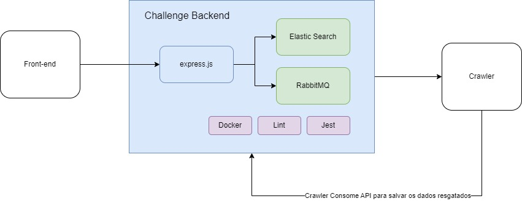

# Challenge Crawler Backend

# Objetivo

Provisionar o backend que será responsável por:

- Expor API REST para consulta consulta no elastic search através do número do cpf
- Expor API REST que invoca uma chamada para o crawler fornecendo o número do cpf
- Expor API REST que recebe os dados retornados do crawler e salva no elastic search 
- Provisionar toda a infra estrutura ( RabbitMQ, Elastic Search ) através de docker

## Arquitetura

### Demais artefatos

Frontend
https://github.com/huguinho-halves/challenge-crawler-frontend

Crawler
https://github.com/huguinho-halves/challenge-crawler

## Coleção do Postman

Todas as request's dessa aplicação, estão dentro de uma coleção do postman dentro da pasta docs/

## Tecnologias utilizadas

- Node.js 18
- Typescript
- Express
- RabbitMq
- Elastic Search
- Lint ( qualidade do código )
- Jest ( testes e coverage )
- Docker

# Principais comandos

## Instalando as dependências
``
npm install
``

## Executando a aplicação
``
npm run start
``

## Executando os testes
``
npm run test
``

## Verificando a porcentagem de cobertura de testes

A aplicação inteira está coberta por testes, e a cobertura para cada função pode ser vista através do comando abaixo

``
npm run test:coverage
``

## Subindo a infra estrutura com o docker

``
docker-compose -up
``